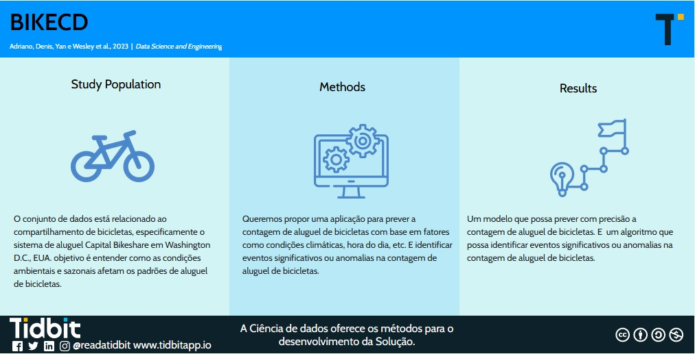

# BikeCD
### Resumo 
Os sistemas de compartilhamento de bicicletas são uma nova geração de aluguel de bicicletas tradicionais, onde todo o processo, desde a adesão, aluguel e devolução, tornou-se automático. Através desses sistemas, o usuário pode facilmente alugar uma bicicleta em uma determinada posição e retornar em outra posição. Atualmente, existem cerca de 500 programas de compartilhamento de bicicletas em todo o mundo, compostos por mais de 500 mil bicicletas. Hoje, existe um grande interesse nestes sistemas devido ao seu importante papel nas questões de trânsito, ambientais e de saúde.
Um dos desafios enfrentados pelos sistemas de compartilhamento de bicicletas é a imprevisibilidade da demanda. Isso pode levar a um excesso ou falta de bicicletas em determinadas estações, o que pode impactar a experiência do usuário.
Este projeto visa desenvolver uma solução tecnológica para prever a demanda de bicicletas em sistemas de compartilhamento. A solução utilizará dados históricos de aluguel de bicicletas, bem como dados meteorológicos e de calendário.

### Resumo Gráfico

## Desenvolvedores
- Denis Dorneles https://github.com/denisddv
- Wesley Santos https://github.com/FWsantos
- Adriano Medeiros Pinheiro https://github.com/AdrianoMedeirosPinheiro
- Yan Lima  https://github.com/Yanlim4
 

